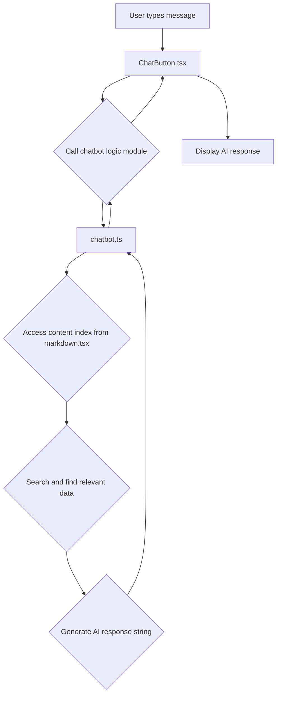

# Chatbot Functionality Plan: Basic Q&A using Existing Data

This document outlines the plan to add basic question-answering functionality to the existing chatbot UI, utilizing the content from the website's blog posts and case studies.

**Objective:**

Enable the chatbot to answer user questions by searching and retrieving relevant information from the website's markdown content.

**Plan:**

1.  **Enhance `src/lib/markdown.tsx`:**
    *   Modify the `src/lib/markdown.tsx` file.
    *   Create and export a searchable index containing key information (titles, excerpts, tags, and potentially full content) from all processed blog posts and case studies. This index will be an array of objects, where each object represents a piece of content with relevant metadata and text.

2.  **Create a Chatbot Logic Module (`src/lib/chatbot.ts`):**
    *   Create a new file named `chatbot.ts` in the `src/lib/` directory.
    *   Import the searchable content index exported from `src/lib/markdown.tsx`.
    *   Implement an asynchronous function, e.g., `answerQuestion(query: string)`, that takes the user's input query as a string.
    *   Inside `answerQuestion`, implement a simple search algorithm (e.g., keyword matching) to find relevant entries in the content index based on the user's query.
    *   Based on the search results, formulate a coherent response string. If relevant content is found, the response should summarize or point to the relevant blog post(s) or case study(ies). If no relevant content is found, provide a polite message indicating that the chatbot could not find an answer.
    *   Export the `answerQuestion` function.

3.  **Integrate Logic into Chat UI (`src/components/chat/ChatButton.tsx`):**
    *   Modify the `src/components/chat/ChatButton.tsx` file.
    *   Import the `answerQuestion` function from `src/lib/chatbot.ts`.
    *   Update the `handleSubmit` function. Instead of adding a canned response after a timeout, call the `answerQuestion` function with the `inputText`.
    *   Use the response received from `answerQuestion` to update the chat messages state, displaying the AI's generated response to the user.
    *   Add error handling in case the `answerQuestion` function encounters an issue.

**Flow Diagram:**

**Future Enhancements (Optional):**

*   Implement a more sophisticated search algorithm (e.g., fuzzy matching, semantic search).
*   Integrate with an external AI model for more natural language understanding and generation (requires backend endpoint and API key management).
*   Add typing indicators to the UI while the chatbot is processing.
*   Improve error handling and user feedback.